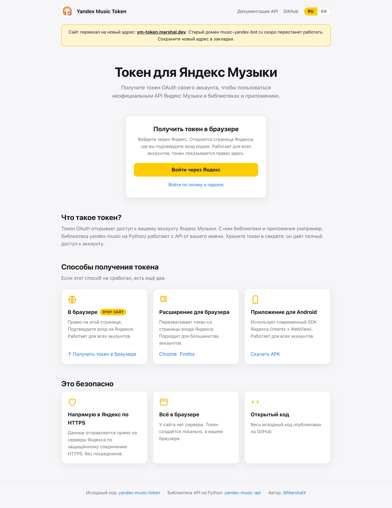

## Сайт-помощник для получения OAuth-токена Яндекс Музыки

Сайт: https://ym-token.marshal.dev

Генерирует токен по логину и паролю прямо в браузере пользователя, а также собирает
все способы получения токена (расширение для браузера, Android-приложение).

Вход по логину и паролю работает на очень старой версии авторизации Яндекса.
Большинство аккаунтов уже не может авторизоваться через это API — в таком случае
используйте другие варианты входа, перечисленные на сайте.

### Стек

- [Vite](https://vite.dev/) + TypeScript, без фреймворков
- Менеджер пакетов — [pnpm](https://pnpm.io/)
- Двуязычный интерфейс (RU/EN), деплой на GitHub Pages

### Разработка

```bash
pnpm install
pnpm dev      # локальный сервер
pnpm build    # сборка в dist/
pnpm deploy   # публикация на GitHub Pages
```

### Скриншот


